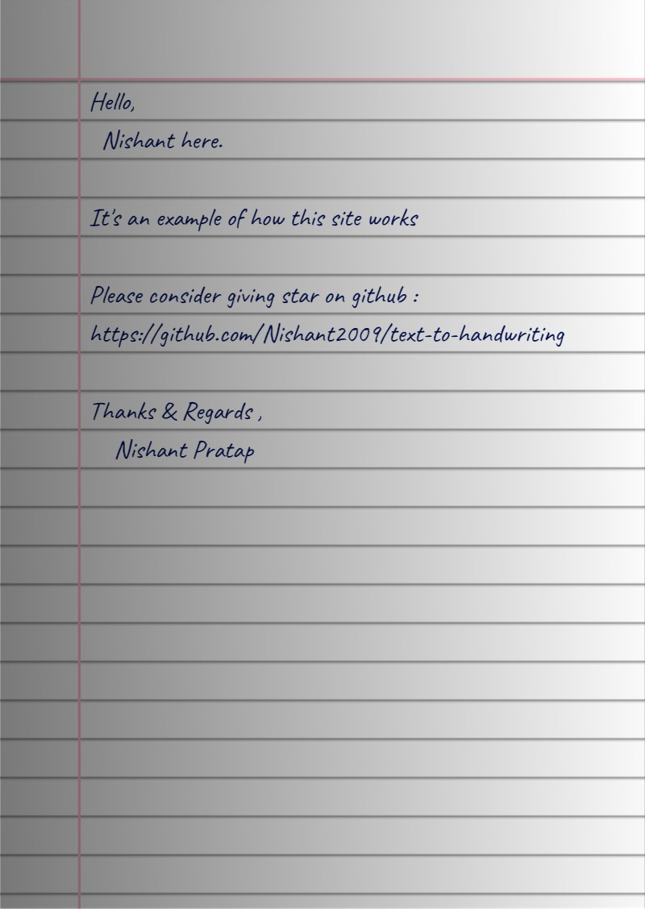

 
 <b><a href="https://tth.svsu-help.me/">https://tth.svsu-help.me/</a></b>        I hate writing assignments so I made this tool that converts text to an image that looks like handwriting😛 

*Note: This project is now archived.*

## 🌠 Output

## 📚 Libraries used

- [html2canvas](https://github.com/niklasvh/html2canvas) - Turns DOM into Canvas.
- [jsPDF](https://github.com/MrRio/jsPDF) - To generate PDF from images.
- [cypress](https://github.com/cypress-io/cypress) - Testing Library
- [serve](https://github.com/zeit/serve) - Start local server

---

Bye!
Have fun 🦄
# [https://tth.svsu-help.me/](https://tth.svsu-help.me/)
